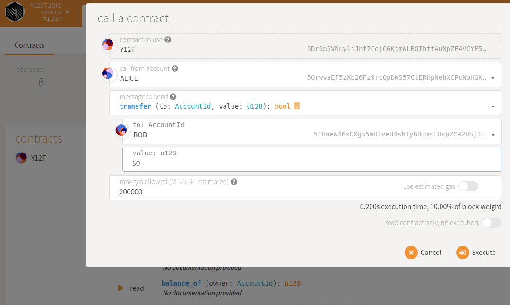
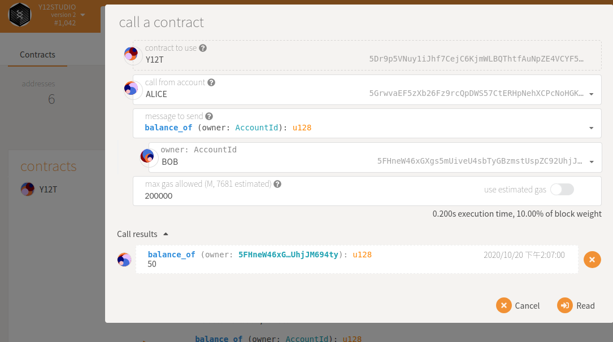
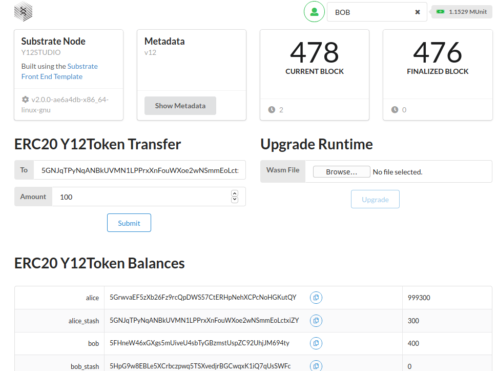

[[INTERMEDIATE CHALLENGE] Smart contracts - write an ERC-20 smart contract with ink! | Polkadot-Network Funded Issue Detail | Gitcoin | Gitcoin](https://gitcoin.co/issue/Polkadot-Network/hello-world-by-polkadot/9/100023935)

# Submission

## node template with the contracts pallet

[added pallet-contracts to substrate node template · y12studio/helloworld-dot@885c05e](https://github.com/y12studio/helloworld-dot/commit/885c05e3cb2ff9f63b3a8e095fbd1adc25146831)

## an ERC20 contract

[added erc20 contract · y12studio/helloworld-dot@ae6a4db](https://github.com/y12studio/helloworld-dot/commit/ae6a4db154f2246e7455de653b1b2d4c136dbfdd)

## send the custom token from one account to another

## Build a simple UI just for sending that one token

[erc20 frontend challenge submission · y12studio/helloworld-dot@b1a89db](https://github.com/y12studio/helloworld-dot/commit/b1a89db4fdb1f9beedc4d855f6346f60034fa66d)

