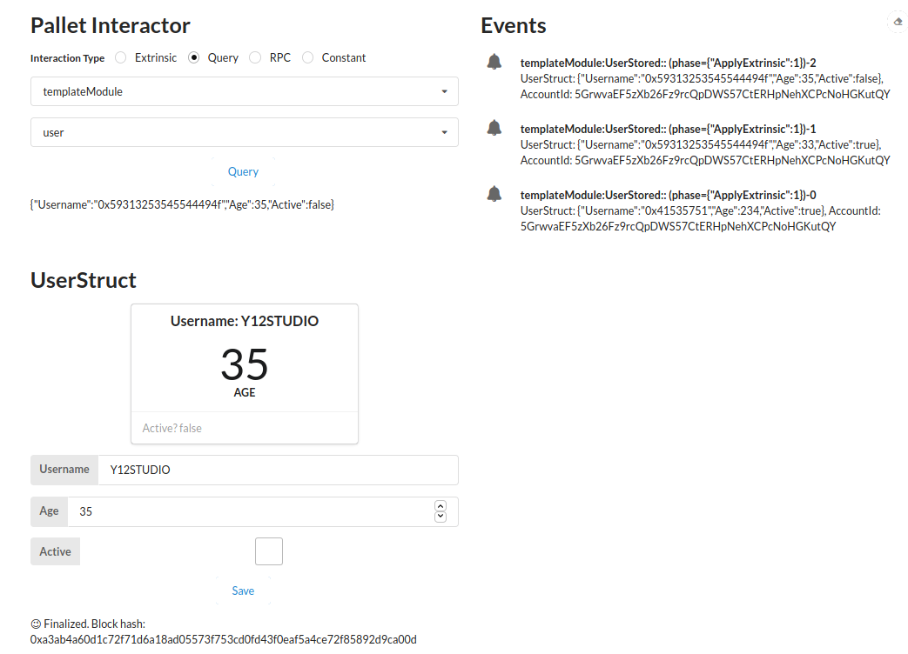

[[INTERMEDIATE CHALLENGE] FRAME Development | Polkadot-Network Funded Issue Detail | Gitcoin | Gitcoin](https://gitcoin.co/issue/Polkadot-Network/hello-world-by-polkadot/7/100023933)

Requirement: Update the Pallet Template to include a storage item for a custom struct. Add at least one dispatchable function to interact with the new storage item.

[updated frame-dev/substrate-node · y12studio/helloworld-dot@fb06473](https://github.com/y12studio/helloworld-dot/commit/fb064732ac146104c05a3f2bcfd3babc1bfb731a)

Requirement: Add the necessary types to the Front-End Template to interact with the new dispatchable.

[updated frame-dev/front-end · y12studio/helloworld-dot@3670f70](https://github.com/y12studio/helloworld-dot/commit/3670f70bb1b2f7677092261830e31122d99b3de6)

FrontEnd Result

