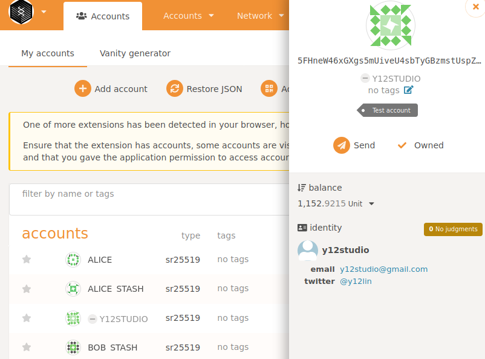

# Result

# Links

- [[INTERMEDIATE CHALLENGE] FRAME Identity: Set an identity on a local --dev chain | Polkadot-Network Funded Issue Detail | Gitcoin | Gitcoin](https://gitcoin.co/issue/Polkadot-Network/hello-world-by-polkadot/10/100023936)
- [Search · impl pallet_identity](https://github.com/search?l=Rust&p=2&q=impl+pallet_identity&type=Code)