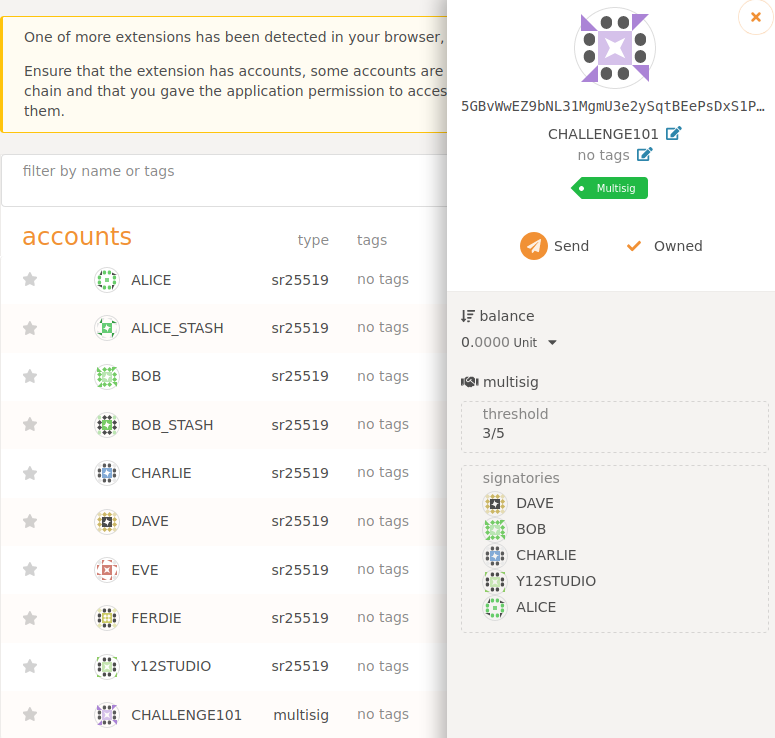
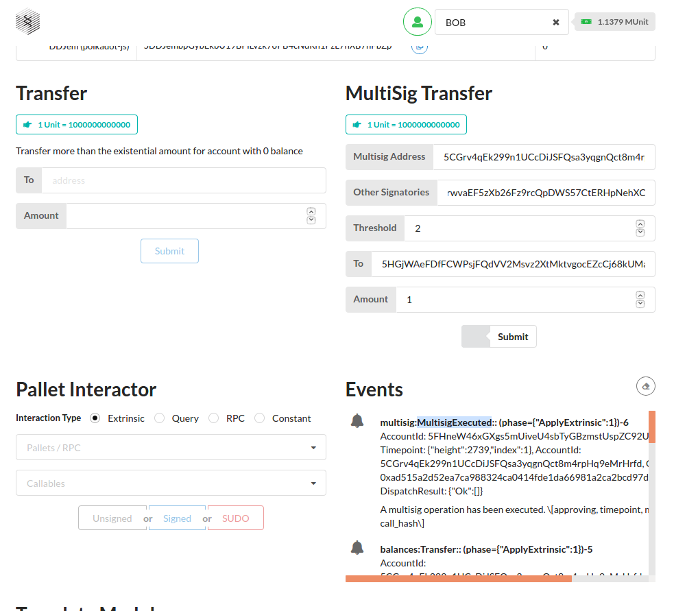
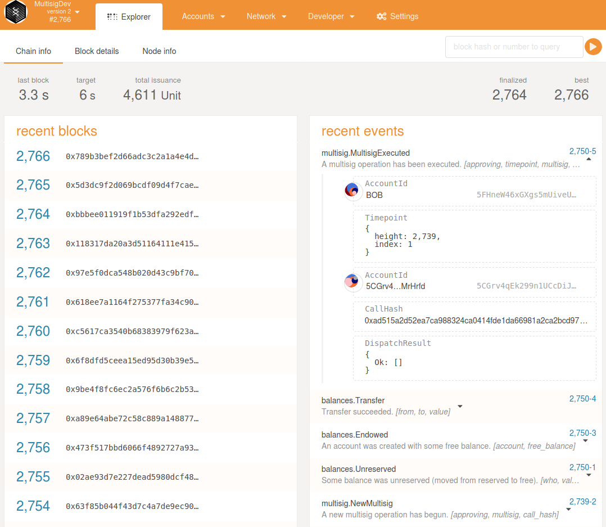

[[INTERMEDIATE CHALLENGE] FRAME Multisig | Polkadot-Network Funded Issue Detail | Gitcoin | Gitcoin](https://gitcoin.co/issue/Polkadot-Network/hello-world-by-polkadot/8/100023934)


> Add the Multisig pallet to the Node Template and create a Polkadot-JS script to make a multisig transaction. Use the Front-End Template to create a multisig UI component.

## Add pallet-multisig to node

- [helloworld-dot/multisig/multisig-node at main · y12studio/helloworld-dot](https://github.com/y12studio/helloworld-dot/tree/main/multisig/multisig-node)
- [add pallet-multisig to runtime · y12studio/helloworld-dot@4423d33](https://github.com/y12studio/helloworld-dot/commit/4423d33e384e72f69f5f2c02d0b6a70571cb1110)



## Polkadot-JS script to make a multisig tx

[helloworld-dot/multisig/multisig-cli at main · y12studio/helloworld-dot](https://github.com/y12studio/helloworld-dot/tree/main/multisig/multisig-cli)

```
$ cd multisig-cli
$ yarn start
$ ts-node src/index start

=== STEP1 Encode a multisig address ===
Multisig address generation info
Addresses: 5GrwvaEF5zXb26Fz9rcQpDWS57CtERHpNehXCPcNoHGKutQY 5FHneW46xGXgs5mUiveU4sbTyGBzmstUspZC92UhjJM694ty 5DAAnrj7VHTznn2AWBemMuyBwZWs6FNFjdyVXUeYum3PTXFy
Threshold: 2
Multisig Address (SS58: 42): 5CGrv4qEk299n1UCcDiJSFQsa3yqgnQct8m4rpHq9eMrHrfd

=== STEP2 Transfer some liquid free balance to the multisig address ===
Write in block: 0xbe6ee00e4928b127d807609b315d58965f058bd9c9326854c4964dd042487bfd
1604887710000: 5CGrv4qEk299n1UCcDiJSFQsa3yqgnQct8m4rpHq9eMrHrfd balance of 13000000000000000 and a nonce of 0
Write in block: 0x8269f6b943886313271eeace2d5a75709e5a9b0fc40316f7f7f88e0f56f09b27
1604887716000: 5CGrv4qEk299n1UCcDiJSFQsa3yqgnQct8m4rpHq9eMrHrfd balance of 28000000000000000 and a nonce of 0

=== STEP3  Transfer form the multisig address to dave account ===
callData: 0x0500306721211d5404bd9da88e0204360a1a9ab8b87c66c1bc2fcdd37f3c2222cc200f008053ee7ba80a
callHash: 0x8848eb8c519930876f9815c55a1ea564387c33cc2c15690ffbb4aee17919bcff

=== STEP4 Alice aprove this call/transaction of multisig account ===
Write in block: 0xcad141b6ad0d1ff9350d68016e74cebce06f7c8d87dbb0f29f837037cde3f6e1
{ height: '7', index: '1' }
1604887722000: 5CGrv4qEk299n1UCcDiJSFQsa3yqgnQct8m4rpHq9eMrHrfd balance of 28000000000000000 and a nonce of 0

=== STEP5 Bob aprove this call/transaction of multisig account ===
Finalized in: 0xbe6ee00e4928b127d807609b315d58965f058bd9c9326854c4964dd042487bfd
Write in block: 0x2208a48547ff449ee5ffd0a098ccdbc2d9864e812a2dca67218f5cfc1c6f50ff
1604887728000: 5CGrv4qEk299n1UCcDiJSFQsa3yqgnQct8m4rpHq9eMrHrfd balance of 25000000000000000 and a nonce of 0
Done in 26.86s.
```

## A multisig UI component

[helloworld-dot/multisig/multisig-frontend at main · y12studio/helloworld-dot](https://github.com/y12studio/helloworld-dot/tree/main/multisig/multisig-frontend)





