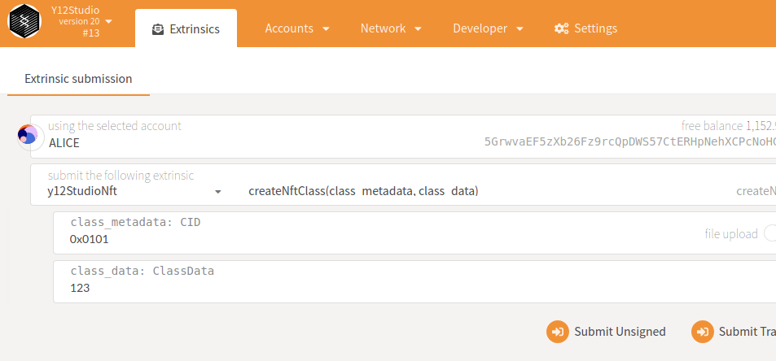
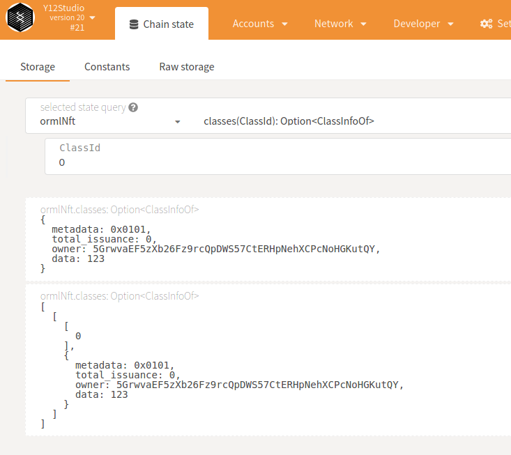
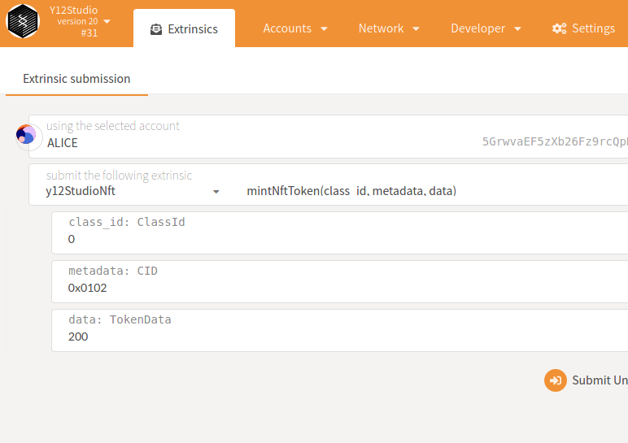
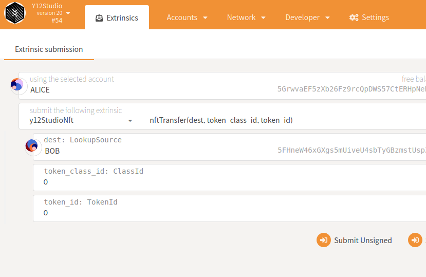
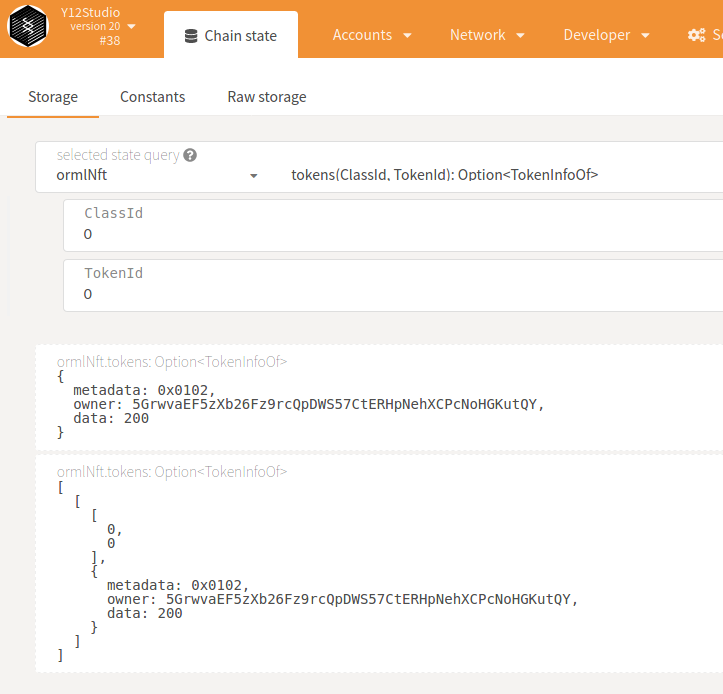

[[ECOSYSTEM CHALLENGE] Enable NFT Support | AcalaNetwork Funded Issue Detail | Gitcoin | Gitcoin](https://gitcoin.co/issue/AcalaNetwork/polakdot-hello-world-acala/1/100023951)

> Submission requirements : Submit the runtime including the orml-nft pallet, bonus is to add and issue your own NFT token.

Runtime:

- [orml-nft-node](orml-nft-node/)
- [added orml-nft to AcalaNetwork challenge · y12studio/helloworld-dot@ba7262e](https://github.com/y12studio/helloworld-dot/commit/ba7262e7c56c8c5b0fb49a307e021c6d09f55d44)

Create a OrmlNFT class

Query NFT classes

Mint a NFT token

Query NFT tokens

Tranfer NFT token

Query NFT tokens

