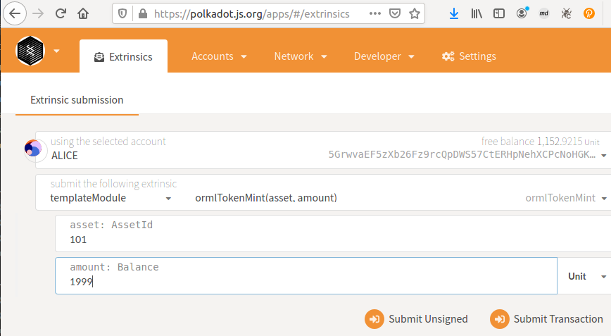
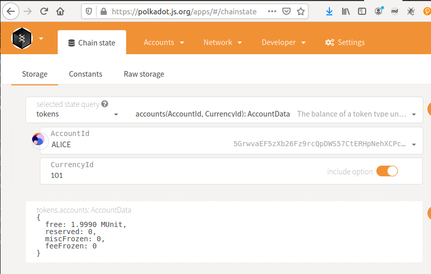
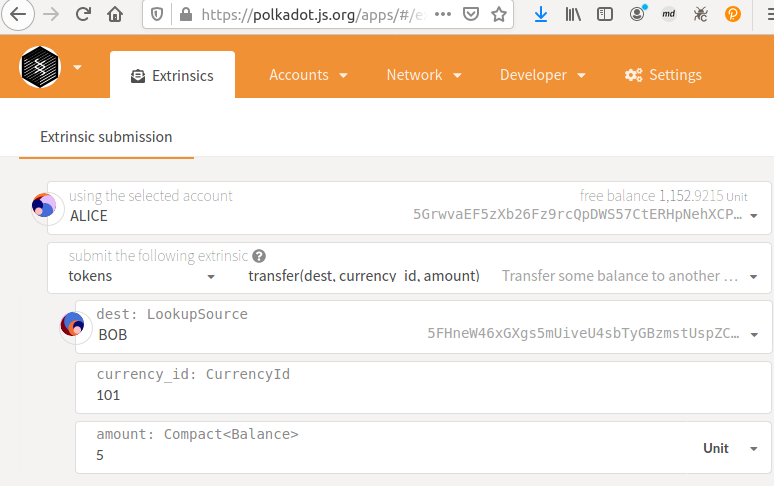
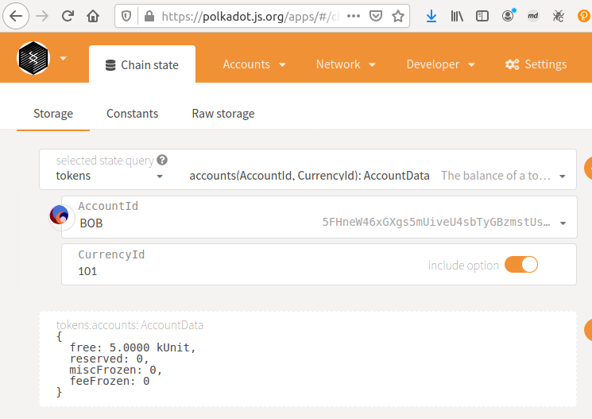

[[ECOSYSTEM CHALLENGE] Enable Multi-Currency Support | AcalaNetwork Funded Issue Detail | Gitcoin | Gitcoin](https://gitcoin.co/issue/AcalaNetwork/polakdot-hello-world-acala/2/100023952)

> Substrate by default only supports a single token. We've developed an open runtime module library specifically orml-token pallet to support multiple tokens. For example, on Acala via this pallet, we can support aUSD (Acala Dollar stablecoin), DOT/KSM, renBTC, PolkaBTC and various other assets. Simply add this into your runtime to enable multi-currency support and starting minting your own tokens. 🔥

# Submission

Runtime: [helloworld-dot/orml-token/orml-token-node/runtime at main · y12studio/helloworld-dot](https://github.com/y12studio/helloworld-dot/tree/main/orml-token/orml-token-node/runtime)

pallet-template: mint token 101

orml-token pallet: query token 101

transfer token 101

query token 101

[updated orml-tokens challenge · y12studio/helloworld-dot@fb091fc](https://github.com/y12studio/helloworld-dot/commit/fb091fcfe1e6716e8950c1247638a8314bf30a8f)