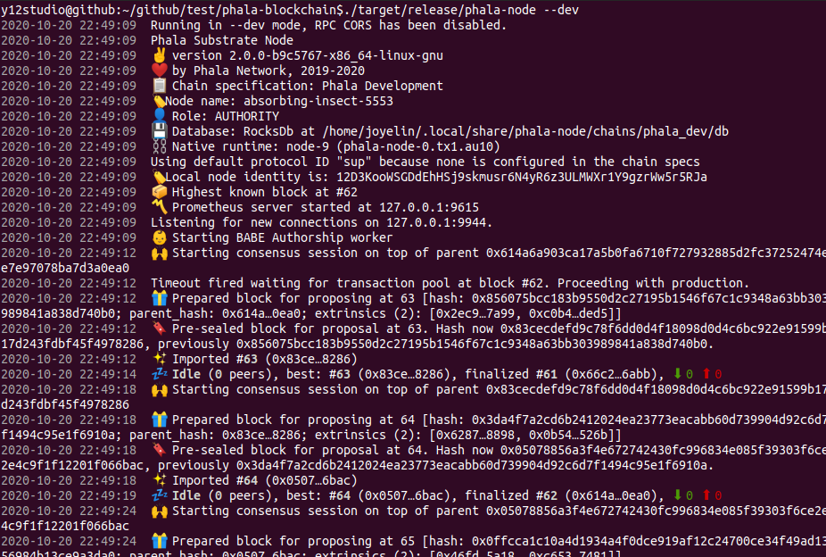
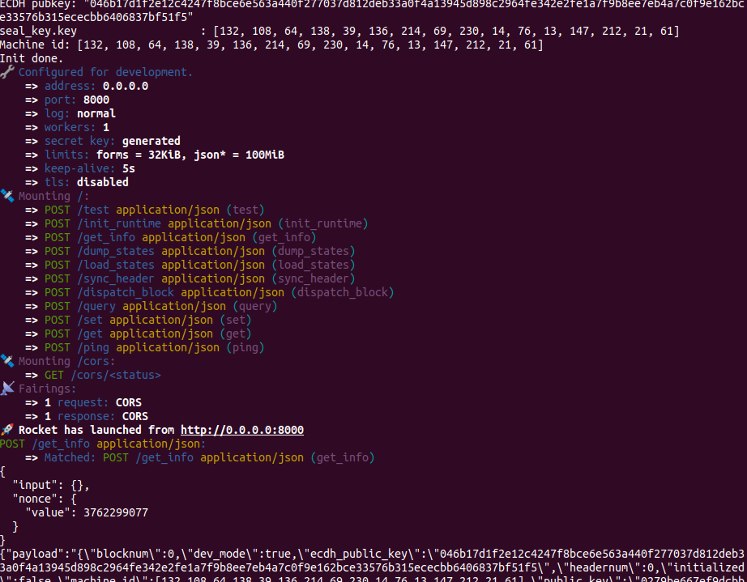
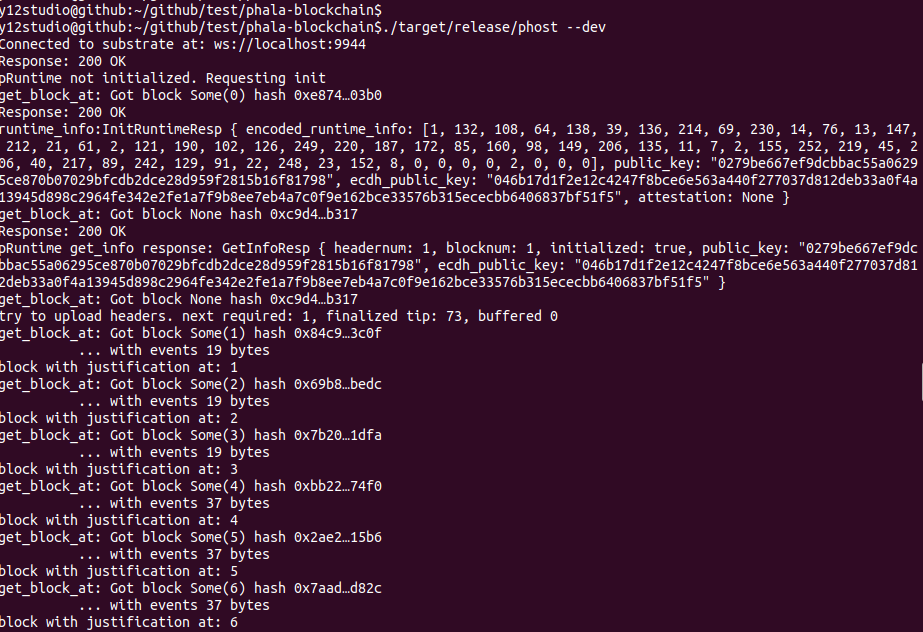
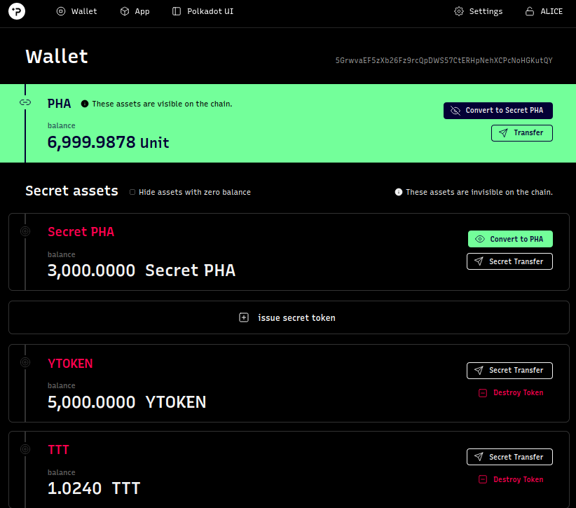

[[ECOSYSTEM CHALLENGE] (Beginner) Build and Run a Local Phala Network | Phala-Network Funded Issue Detail | Gitcoin | Gitcoin](https://gitcoin.co/issue/Phala-Network/hello-world-by-polkadot/1/100023945)

# Submission

Take screenshots of the terminal window with the running core blockchain (phala-node, pruntime, and phost)

phala-node

pruntime

phost

Take a screenshot of your user-issued secret token

Send the screenshot and share your feeling on Twitter

[Twitter post](https://twitter.com/y12lin/status/1318572262832795648)