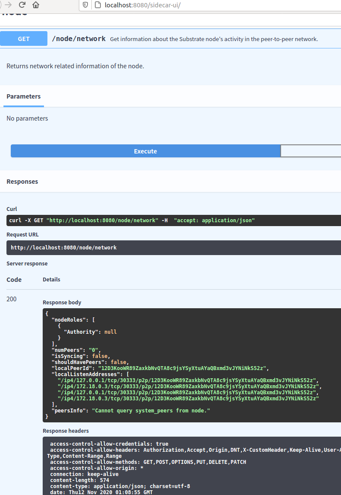
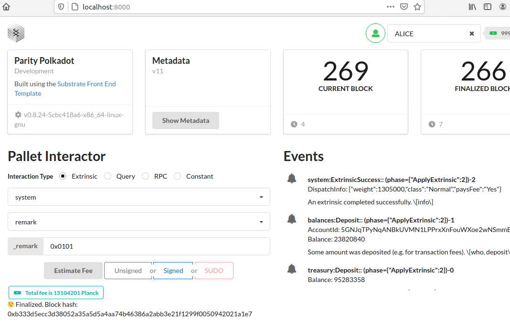

[[ADVANCED CHALLENGE] REST APIs - Build a transaction fee estimator | Polkadot-Network Funded Issue Detail | Gitcoin | Gitcoin](https://gitcoin.co/issue/Polkadot-Network/hello-world-by-polkadot/4/100023930)


To generate [javascript](https://openapi-generator.tech/docs/generators/javascript) with [OpenAPITools/openapi-generator](https://github.com/OpenAPITools/openapi-generator)

```
$ wget https://raw.githubusercontent.com/paritytech/substrate-api-sidecar/master/docs/src/openapi-v1.yaml
$ docker run --rm -v "${PWD}:/local" openapitools/openapi-generator-cli generate \
    -i /local/openapi-v1.yaml -g javascript --additional-properties=usePromises=true -o /local/sidecar-js
$ cd sidecar-js
$ yarn build
$ mv ../substrate-frontend/src/sidecar-api
```

sidecar-api service http://localhost:8080/

```
$ docker-compose up -d
```




a fee estimator UI

[helloworld-dot/sidecar-fee/substrate-frontend at main · y12studio/helloworld-dot](https://github.com/y12studio/helloworld-dot/tree/main/sidecar-fee/substrate-frontend)

```
$ docker-compose up -d
$ cd substrate-frontend
$ yarn start
```

