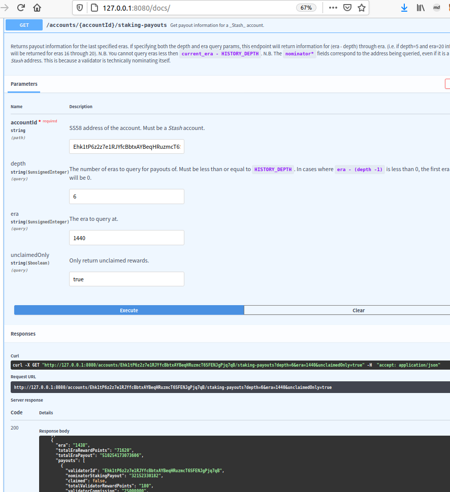

[[ADVANCED CHALLENGE] REST APIs - Read an account's pending payouts | Polkadot-Network Funded Issue Detail | Gitcoin | Gitcoin](https://gitcoin.co/issue/Polkadot-Network/hello-world-by-polkadot/5/100023931)

> Provide a link to a Gist or Github repository that demonstrates a script to calculate pending payouts by sending HTTP requests to a local Sidecar instance.

# Submission

a local instance of Sidecar and a local Kusama node.

[mapping express openapi swagger-ui /docs to static path docs/dist · y12studio/substrate-api-sidecar@1001240](https://github.com/y12studio/substrate-api-sidecar/commit/100124064f5103568ceae47f4bd0b0e94be378ce)


read node/version


read pending payouts by openapi swagger ui 



a script to calculate pending payouts

To generate rust code with [OpenAPITools/openapi-generator](https://github.com/OpenAPITools/openapi-generator)

```
$ wget https://raw.githubusercontent.com/paritytech/substrate-api-sidecar/master/docs/src/openapi-v1.yaml
$ docker run --rm -v "${PWD}:/local" openapitools/openapi-generator-cli generate \
    -i /local/openapi-v1.yaml \
    -g rust \
    --library reqwest \
    -o /local/substrate_sidecar
```

[openapitools/openapi-generator-cli generate rust sidecar api code · y12studio/helloworld-dot@bc3a44b](https://github.com/y12studio/helloworld-dot/commit/bc3a44be5516bab8ef81d36c6a5516a22ab65a2e)

```
$ cd pending-payouts
$ cargo build --release
$ target/release/pending-payouts -h
pending-payouts 0.0.1
y12studio@gmail.com

USAGE:
    pending-payouts --account <account> --depth <depth> --era <era>

FLAGS:
    -h, --help       Prints help information
    -V, --version    Prints version information

OPTIONS:
    -a, --account <account>    
    -d, --depth <depth>        
    -e, --era <era>            

$ target/release/pending-payouts -a DTLcUu92NoQw4gg6VmNgXeYQiNywDhfYMQBPYg2Y1W6AkJF -d 14 -e 1443
account_id: DTLcUu92NoQw4gg6VmNgXeYQiNywDhfYMQBPYg2Y1W6AkJF
depth: 14
era: 1443
669970599257
pending payout(Planck): 669970599257
pending payout(KSM): 0.669970599257
```


