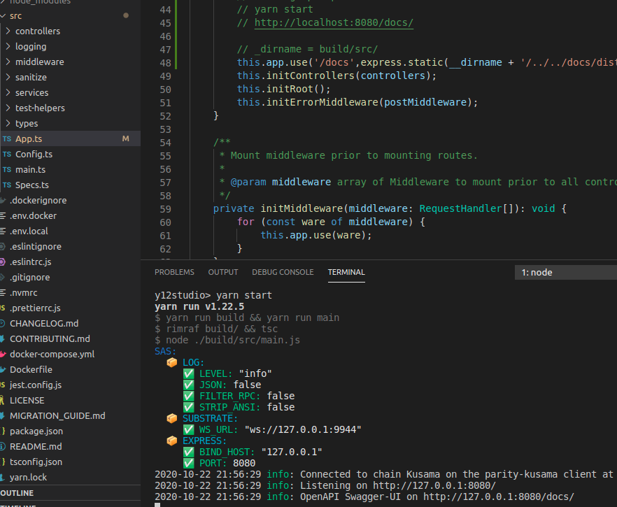
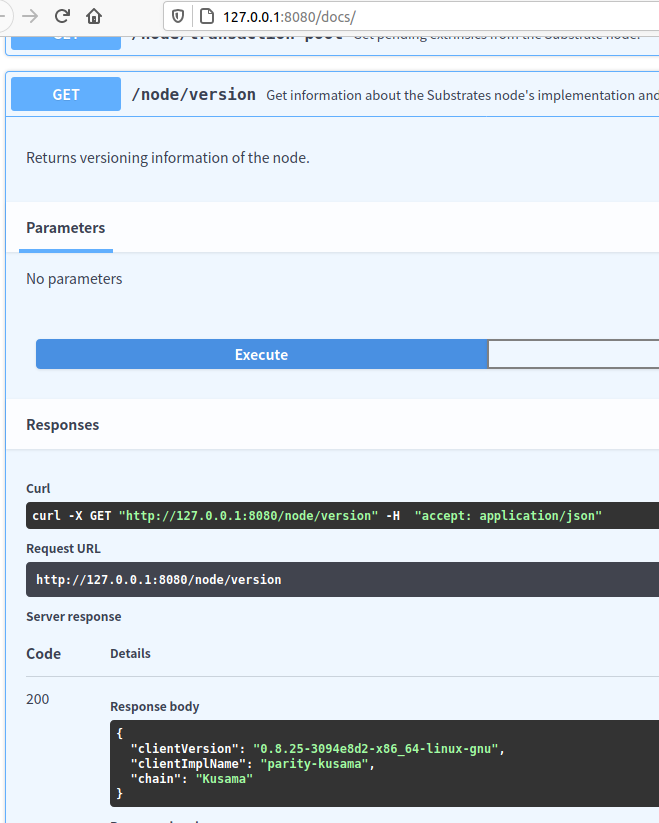

[[ADVANCED CHALLENGE] REST APIs - Read an account's pending payouts | Polkadot-Network Funded Issue Detail | Gitcoin | Gitcoin](https://gitcoin.co/issue/Polkadot-Network/hello-world-by-polkadot/5/100023931)

> Provide a link to a Gist or Github repository that demonstrates a script to calculate pending payouts by sending HTTP requests to a local Sidecar instance.

# Submission

a local instance of Sidecar and a local Kusama node.

[mapping express openapi swagger-ui /docs to static path docs/dist · y12studio/substrate-api-sidecar@1001240](https://github.com/y12studio/substrate-api-sidecar/commit/100124064f5103568ceae47f4bd0b0e94be378ce)





TODO

a script to calculate pending payouts

To generate rust code with [OpenAPITools/openapi-generator](https://github.com/OpenAPITools/openapi-generator)

```
$ cd substrate-api-sidecar/docs
$ docker run --rm -v "${PWD}:/local" openapitools/openapi-generator-cli generate \
    -i /local/src/openapi-v1.yaml \
    -g rust \
    --library reqwest \
    -o /local/out/sidecar
```

[openapitools/openapi-generator-cli generate rust sidecar api code · y12studio/substrate-api-sidecar@c0160c3](https://github.com/y12studio/substrate-api-sidecar/commit/c0160c3d092c3a0434381762397761496f88e4d9)


